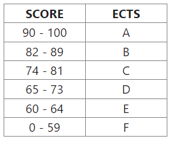

Package include a class called **_ECTS_**, exported this class. The constructor of this class accept one parameter, which is the score in the 100-point format. The class have a method called **_ectsFromScore()_** that returns the corresponding **_ECTS_** value for the given score.

The score-to-ECTS conversion ratios are provided in the table.

